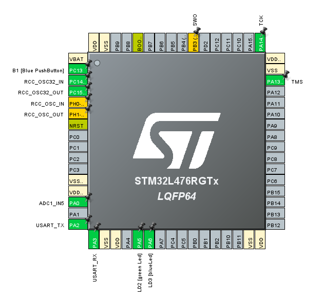
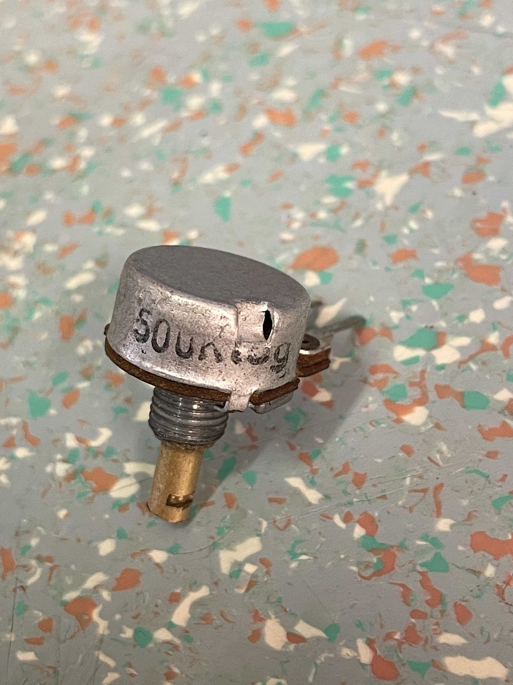

# Enkratna_ADC_pretvorb

1. Cilj naloge: S pomočjo programskega okolja STM32CubeIDE in HAL knjižnicami sprogramirajte 
   ARM mikroprocesor tako,da bo izvedel posamične ADC pretvorbe z izbranim potenciometrom.

2. Postopek inicializacije periferije.  
    -  Uporabljena razvojna plošča je **NUCELO-L476RG**.  
    - Zeldena LED je priključena na **PA5** pinu, Modra LED pa na **PA6**. Na pin **PA0** je priključen potenciometer.  
    - Razvojna ploščica ima **3** ADC  pretvorbo.  
    - Trikotnik predstavlja opozorilo da je nekje med pini knonflikt. Ta konflikt resimo tako da odstranimo pine oziroma jih nastavimo na **set-reset**.  
    - ADC ima **16** vhodnih kanalov.  
    - Za branje potenciometra je izbran kanal **IN5**. poleg pina se izpiše **ADC1_IN5**.pin je **PA0**  
    - Ostale možnosti ADC pretvorbe so:  
      |   6 bit    |    10 bit    |    12 bit    |    16 bit     |
      | :--------: | :----------: | :----------: | :-----------: |
      | od 0 do 63 | od 0 do 1023 | od 0 do 4095 | od 0 do 65535 |

## CubeMx PinOut      

## Poteniciometer
  

## Komenatar
Delovanje se mi zdi brezhibno.

